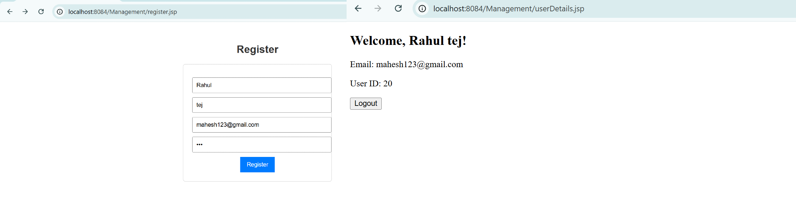
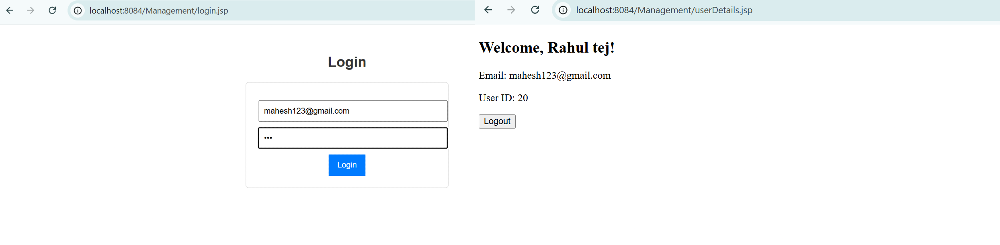
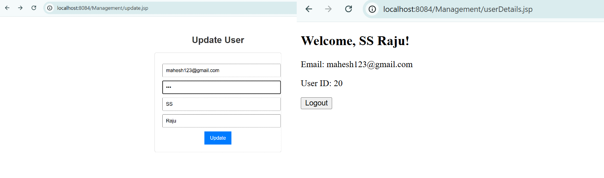
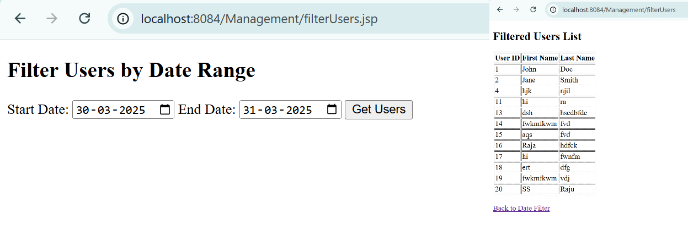

# User Management System

## 📌 Overview
This project is a **User Management System** built using **Jakarta EE (Java Servlets, JSP, and MySQL)**. It allows users to **create, update, delete, and filter users** based on a date range.

## 🚀 Features
- **User Registration**: Add new users with first name, last name, email, and password.
- **User Update**: Modify user details securely.
- **User Deletion**: Remove a user from the database.
- **Session Management**: Maintains login sessions.
- **Filter Users**: Display users between specific dates.

## 🛠 Technologies Used
- **Backend**: Java Servlets, JSP, JDBC
- **Frontend**: HTML, CSS, JSP
- **Database**: MySQL
- **Server**: Apache Tomcat

## 📂 Project Structure
```
User-Management/
├── src/
│   ├── com/logiscope/servlets/
│   │   ├── DatabaseConnection.java
│   │   ├── User.java
│   │   ├── RegisterServlet.java
│   │   ├── UpdateServlet.java
│   │   ├── DeleteServlet.java
│   │   ├── UserFilterServlet.java
│
├── WebContent/
│   ├── index.jsp
│   ├── register.jsp
│   ├── update.jsp
│   ├── delete.jsp
│   ├── filterUsers.jsp
│   ├── displayUsers.jsp
│
├── web.xml
├── README.md
```

## 🛠 Setup Instructions
### 1️⃣ Clone the Repository
```sh
git clone https://github.com/Mahesh0843/logiscope_assignment.git
```

### 2️⃣ Configure MySQL Database
Create a database and a `users` table:
```sql
CREATE DATABASE logs;
USE logs;

CREATE TABLE users (
    id INT NOT NULL AUTO_INCREMENT PRIMARY KEY,
    first_name VARCHAR(50) NOT NULL,
    last_name VARCHAR(50) NOT NULL,
    email VARCHAR(100) NOT NULL UNIQUE,
    password VARCHAR(255) NOT NULL,
    created_at TIMESTAMP DEFAULT CURRENT_TIMESTAMP,
    updated_at TIMESTAMP DEFAULT CURRENT_TIMESTAMP ON UPDATE CURRENT_TIMESTAMP
);
```

### 3️⃣ Configure Database Connection
Edit `DatabaseConnection.java` with your MySQL credentials:
```java
private static final String URL = "jdbc:mysql://localhost:3306/logs";
private static final String USER = "root";
private static final String PASSWORD = "password";
```

### 4️⃣ Run on Tomcat
- Import the project into **Eclipse**.
- Add **Tomcat Server** (Apache Tomcat 10+ recommended).
- Deploy the project and start the server.
- Access via: `http://localhost:8084/User-Management`

## 📌 API Endpoints
| Method | Endpoint | Description |
|--------|---------|-------------|
| `POST` | `/create` | Register a new user |
| `POST` | `/get` | Login a user |
| `POST` | `/update` | Update user details |
| `POST` | `/delete` | Delete a user |
| `POST` | `/filterUsers` | Get users by date range |

## 📌 Additional Features
- **Timestamps**: `created_at` and `updated_at` track user creation and updates.
- **Session Management**: User sessions are stored with an expiry of 24 hours.
```java
session.setMaxInactiveInterval(24 * 60 * 60);
```

## ❓ Why All Endpoints Use POST Method?
In **Servlets**, **POST** is used for all operations because:
- **Security**: Prevents sensitive data from being exposed in the URL.
- **Consistency**: Ensures uniform handling of form submissions and data modifications.
- **Avoiding Caching Issues**: `GET` requests can be cached, which is not suitable for modifying data.
- **Handling Large Payloads**: `POST` supports sending larger data in the request body.
- **Why Not DELETE?** Many browsers and HTML forms do not support `DELETE` directly, making `POST` a more compatible choice.

## 🖥️ Output Screenshots

### 1️⃣ Registration Page


### 2️⃣ User Login


### 3️⃣ Update User


### 4️⃣ Filter Users


